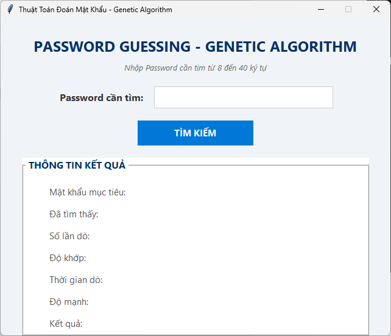
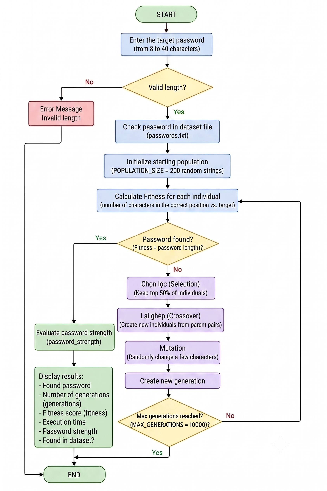

# Password Guessing using Genetic Algorithm

A final project for the Introduction to Artificial Intelligence course.

This project applies the Genetic Algorithm to simulate the process of searching for a target password. The program generates a population of random candidate strings and gradually evolves them through selection, crossover, and mutation until a candidate matches the target password.

The target password can be either a password contained in the dataset or a password that is completely outside the dataset. After the search process, the program determines whether the target password exists in the `passwords.txt` dataset.

## Features

* Search for passwords using Genetic Algorithm
* Search for passwords inside or outside the dataset
* Check whether the target password exists in the dataset
* Generate random candidate populations
* Evaluate candidate solutions using a fitness function
* Select the best individuals
* Perform crossover between parent individuals
* Apply mutation to maintain population diversity
* Evaluate password strength
* Display the search result through a Tkinter GUI
* Measure the number of generations and execution time

## Main Functionality

The program has two main functions:

### 1. Password Search

The user enters a target password with a length from 8 to 40 characters.

The Genetic Algorithm then creates a population of random candidate passwords and evolves them through multiple generations.

The algorithm continues until:

* The target password is found, or
* The maximum number of generations is reached.

The algorithm can search for any target password, regardless of whether the password exists in the dataset.

### 2. Dataset Checking

The program uses the `passwords.txt` file as a dataset of common passwords.

Before the Genetic Algorithm starts, the program checks whether the target password exists in the dataset.

The result is displayed in the GUI:

* `Tìm thấy trong file dataset`: The target password exists in `passwords.txt`.
* `Nằm ngoài file dataset`: The target password does not exist in `passwords.txt`.

This allows the program to distinguish between passwords that are included in the dataset and passwords that are outside the dataset.

## User Interface

The application provides a graphical user interface built with Tkinter.

The interface allows users to:

* Enter a target password
* Start the Genetic Algorithm search
* View the best candidate found
* View the number of generations
* View the fitness score
* View the execution time
* View the password strength
* Check whether the password exists in the dataset



## Algorithm Workflow

1. The user enters a target password.
2. The program validates the password length.
3. The target password is checked against the `passwords.txt` dataset.
4. The program creates an initial population of random candidate passwords.
5. Each individual is evaluated using the fitness function.
6. The best individuals are selected as parents.
7. Crossover combines parts of two parents to create new children.
8. Mutation randomly changes characters in the new individuals.
9. The new population replaces the previous population.
10. The process continues until the target is found or the maximum number of generations is reached.
11. The program displays the best result and search statistics.
12. The program reports whether the target password is inside or outside the dataset.

### Workflow Diagram

The following diagram illustrates the complete workflow of the Password Guessing system using the Genetic Algorithm.



## Genetic Algorithm Components

### Population

The program creates a population of 200 random individuals.

```python
POPULATION_SIZE = 200
```

Each individual has the same length as the target password.

### Fitness Function

The fitness function compares each character of an individual with the corresponding character of the target password.

Each matching character increases the fitness score.

For example:

```text
Target:     abc123
Candidate:  abcxyz
Fitness:    3 / 6
```

A higher fitness score means that the candidate is more similar to the target password.

### Selection

The program evaluates all individuals and selects the individuals with the highest fitness scores to become parents for the next generation.

The top 50% of the population are selected.

### Crossover

Two selected parent individuals exchange parts of their strings to create a new child.

A random crossover point is selected:

```text
Parent 1: ABC|123
Parent 2: XYZ|789

Child:    ABC|789
```

### Mutation

Mutation randomly changes characters in an individual.

The mutation rate is:

```python
MUTATION_RATE = 0.05
```

Mutation helps maintain population diversity and prevents the algorithm from becoming stuck in a limited search area.

## Password Dataset

The project uses the following dataset:

```text
passwords.txt
```

The dataset is used only to determine whether the target password is included in the list of common passwords.

The Genetic Algorithm itself does not search only within the dataset.

It generates candidate passwords using the defined character set:

```python
CHARSET = string.ascii_letters + string.digits + string.punctuation + " "
```

Therefore, the program can search for:

* A password that exists in `passwords.txt`
* A password that does not exist in `passwords.txt`

## Password Strength Evaluation

After the Genetic Algorithm finds the best candidate, the program evaluates the password strength based on:

* Password length
* Uppercase letters
* Lowercase letters
* Numbers
* Special characters

The password is classified into four levels:

* Easy
* Medium
* Strong
* Very Strong

## Parameters

| Parameter           |  Value | Description                              |
| ------------------- | -----: | ---------------------------------------- |
| Population Size     |    200 | Number of individuals in each generation |
| Mutation Rate       |   0.05 | Probability of mutation                  |
| Maximum Generations | 10,000 | Maximum number of generations            |

## Output Information

The GUI displays:

* Target password
* Best candidate found
* Number of generations
* Fitness score
* Execution time
* Password strength
* Dataset status

Example:

```text
Target Password: Example@123

Found:
Example@123

Fitness:
10 / 10

Dataset Result:
Found in dataset
```

or:

```text
Dataset Result:
Outside dataset
```

## Requirements

* Python 3.x
* Tkinter

The project uses Python Standard Library modules and does not require external Python packages.

## How to Run

Clone the repository:

```bash
git clone https://github.com/YOUR_USERNAME/AI-Final-Project-Genetic-Algorithm.git
```

Move into the project directory:

```bash
cd AI-Final-Project-Genetic-Algorithm
```

Run the program:

```bash
python GeneticAlgorithm.py
```

## Project Structure

```text
AI-Final-Project-Genetic-Algorithm/
│
├── GeneticAlgorithm.py
├── passwords.txt
├── README.md
├── requirements.txt
└── .gitignore
```

## Course

Final Project - Introduction to Artificial Intelligence

## Algorithm

Genetic Algorithm (GA)
